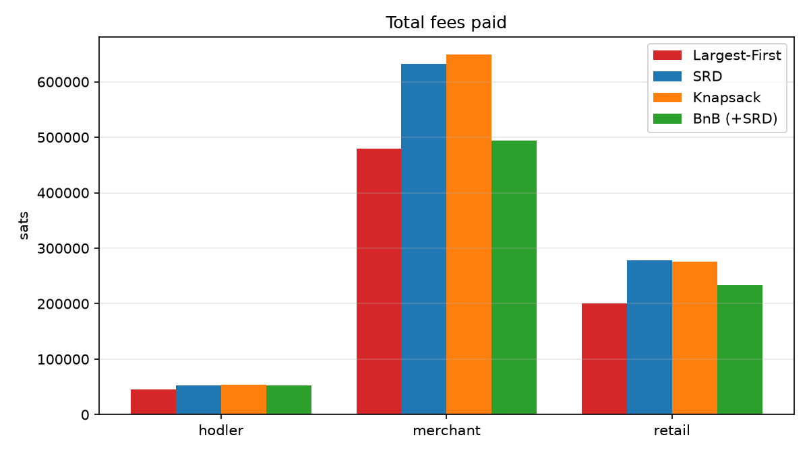
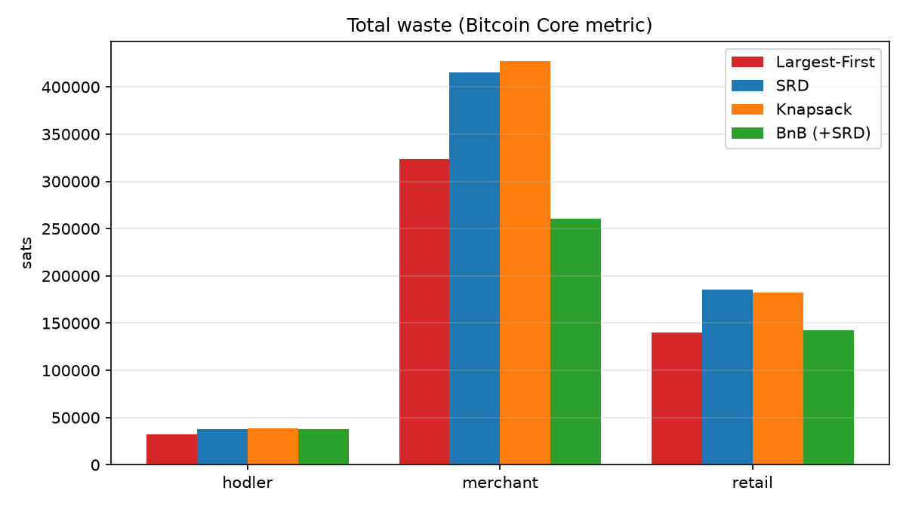
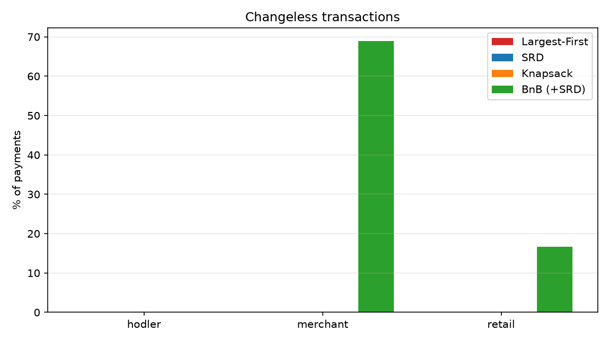
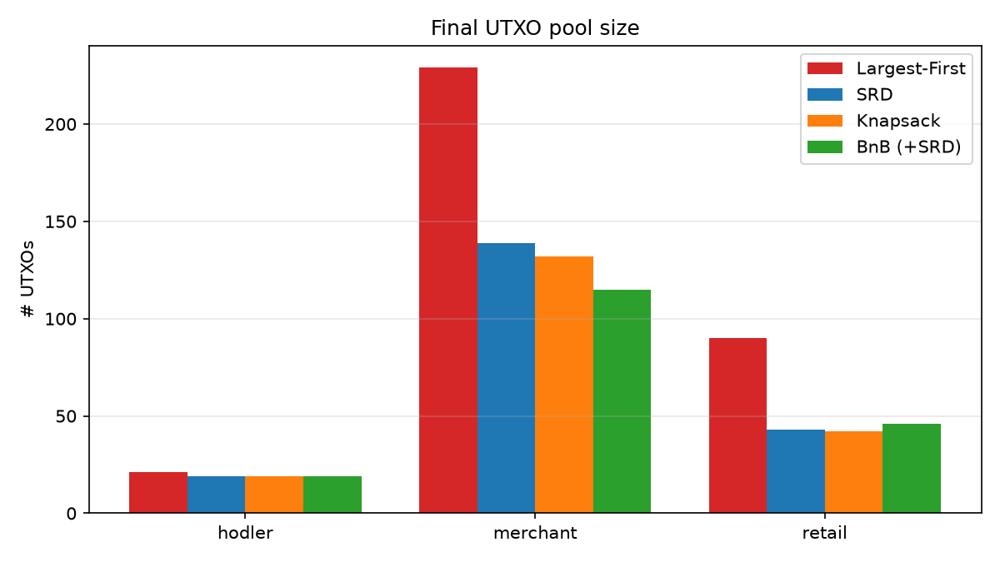
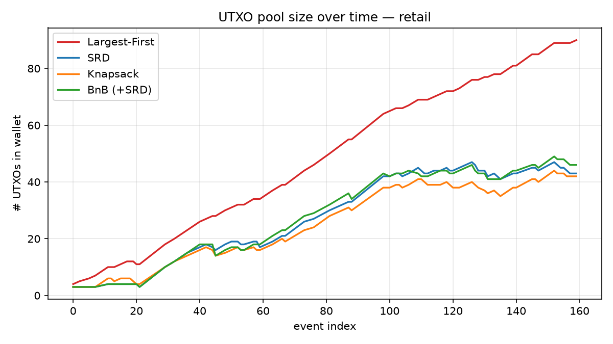
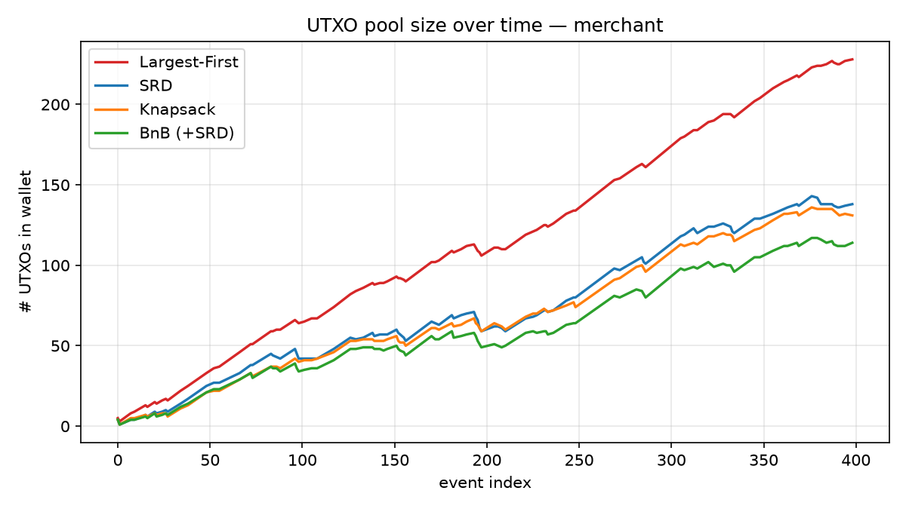
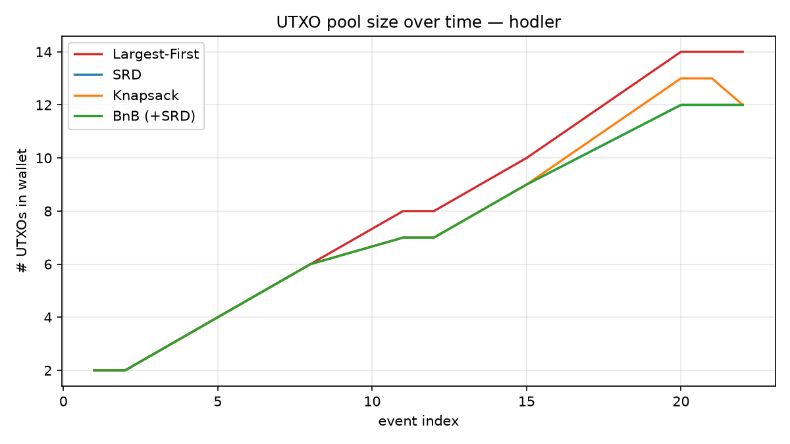

# Results

## Experimental setup

Three deterministic scenarios (seed 42; see `scenarios/generate.py`), each replayed once per algorithm with the same RNG seed (1234), so differences come only from selection policy. Fee regime: 60% calm (1–10 sat/vB), 30% busy (10–40), 10% spike (40–150); long-term feerate 10 sat/vB.

| Scenario | Profile | Events | Payments |
|---|---|---|---|
| `retail` | personal wallet, small frequent receives/pays | 160 | 72 |
| `hodler` | few large receives, rare payments | 30 | 10 |
| `merchant` | heavy inflow, periodic larger payouts | 400 | 103 |

All payments succeeded in all runs (no liquidity failures).

## Summary

| scenario | algorithm | total fees | total waste | mean inputs | changeless % | final UTXOs |
|---|---|---:|---:|---:|---:|---:|
| retail | largest_first | 200 790 | 140 298 | 1.03 | 0.0 | **90** |
| retail | srd | 277 939 | 185 487 | 1.68 | 0.0 | 43 |
| retail | knapsack | 275 679 | 182 547 | 1.69 | 0.0 | 42 |
| retail | bnb | 232 739 | **142 327** | 1.47 | **16.7** | 46 |
| hodler | largest_first | **45 748** | **32 235** | 1.00 | 0.0 | 21 |
| hodler | srd | 52 977 | 38 104 | 1.20 | 0.0 | 19 |
| hodler | knapsack | 53 793 | 38 920 | 1.20 | 0.0 | 19 |
| hodler | bnb | 52 977 | 38 104 | 1.20 | 0.0 | 19 |
| merchant | largest_first | **479 648** | 323 809 | 1.76 | 0.0 | **229** |
| merchant | srd | 632 300 | 415 261 | 2.63 | 0.0 | 139 |
| merchant | knapsack | 648 948 | 427 149 | 2.70 | 0.0 | 132 |
| merchant | bnb | 493 691 | **260 332** | 2.17 | **68.9** | 115 |

(fees and waste in sats; full data in `results/summary.csv`)






## UTXO pool over time





## Discussion

**Largest-First's low fees are a loan, not a saving.** It pays the least in fees in every scenario because it touches the fewest inputs, but it never consolidates. In the merchant scenario it ends with **229 UTXOs, roughly 2× any other algorithm**, and in retail with 90 vs. ~45. Those fragments must eventually be spent; if that happens during a fee spike, the deferred cost exceeds today's savings. The waste metric already hints at this: its fee advantage does not translate into a proportional waste advantage.

**BnB converts pool diversity into changeless payments.** With a merchant-style pool full of medium receives, BnB finds an exact-match subset for **68.9%** of payments, eliminating change output cost *and* the privacy leak of change. It achieves the lowest waste of all algorithms in that scenario (260 332 vs. 415 261 for SRD, −37%) while paying only 3% more in fees than Largest-First. In retail it still manages 16.7% changeless payments.

**BnB depends on the pool it is given.** In the hodler scenario. One huge coin, few payments where BnB never finds a match (0% changeless) and degrades gracefully to its SRD fallback, matching SRD exactly. Changeless selection is an emergent property of *pool composition*, which suggests wallets could deliberately shape their pools (e.g., consolidating in calm periods into payment-sized denominations) to raise BnB's hit rate.

**SRD and knapsack behave similarly, and knapsack's precision buys little.** Across all scenarios their fees, waste and pool sizes track closely; knapsack's 1 000 optimization passes yield marginally smaller change but no meaningful waste advantage over a single random draw — consistent with Bitcoin Core's decision to keep SRD as the simple fallback.

## Limitations and future work

Our knapsack is a simplified form of Core's legacy solver; the simulator models a single output type (P2WPKH) and one payment per transaction (no batching). Natural extensions: replay real wallet histories, add Core's newest `CoinGrinder` (2024) solver, model input-count privacy heuristics explicitly, and test pool-shaping consolidation policies.

## Reproducing

```bash
pip install -r requirements.txt
python -m pytest tests/          # 14 tests
python scenarios/generate.py     # regenerate scenario JSONs
python experiments/run_experiments.py
```